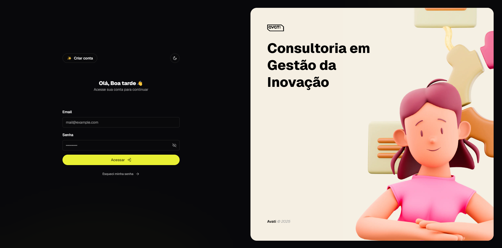

# Avati Challenge

[](https://diegofrr.github.io)

## Sumário

- [Sobre o projeto](#📝-sobre-o-projeto)
- [Tecnologias](#💻-tecnologias)
- [Iniciando](#🚀-iniciando)
  - [Pré-requisitos](#pré-requisitos)
  - [Instalação](#instalação)
  - [Rodando a aplicação](#rodando-a-aplicação)
- [Credenciais](#🔐-credenciais)
    
## 📝 Sobre o projeto

Este projeto consiste em uma tela de login funcional desenvolvida para como parte do processo seletivo da **Avati** para a vaga de **Estágio em Programação Frontend**.

## 💻 Tecnologias

- **Next.js**: Framework React para renderização no servidor e sites estáticos; 
- **Shadcn/ui**: Componentes prontos baseados em Radix UI e Tailwind CSS; 
- **Tailwind CSS**: Framework CSS utilitário para estilização rápida e eficiente; 
- **Zustand**: Biblioteca leve para gerenciamento de estado no React; 
- **React Query**: Biblioteca para busca e cache de dados no React.
  
## 🚀 Iniciando

### Pré-requisitos

- **[Node.js](https://nodejs.org/)**

### Instalação

1. **Faça o clone do repositório**:

   ```bash
   git clone https://github.com/diegofrr/avati-challenge.git
   cd avati-challenge
   ```

2. **Instale as dependências**:

   ```bash
   pnpm install
   #or
   yarn install
   #or
   npm install
   ```

### Rodando a aplicação

```bash
pnpm dev
#or
yarn dev
#or
npm run dev
```

A aplicação ficará disponível em: `http://localhost:3000`.

## 🔐 Credenciais

As credenciais de acesso estão disponíveis no arquivo `DemoDatabase.ts` e podem ser editadas.

Segue e-mails e senhas:

```
joao@mail.com
joao123

maria@mail.com
maria123

pedro@mail.com
pedro123
```
